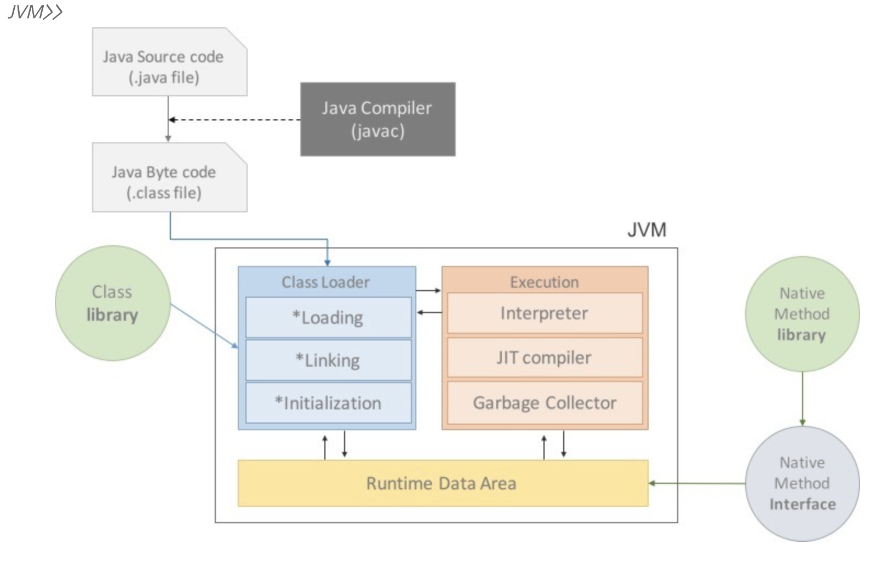
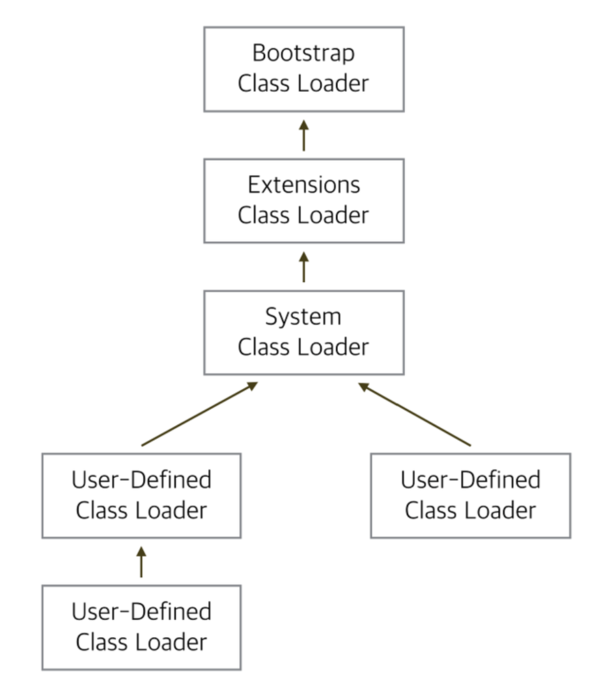
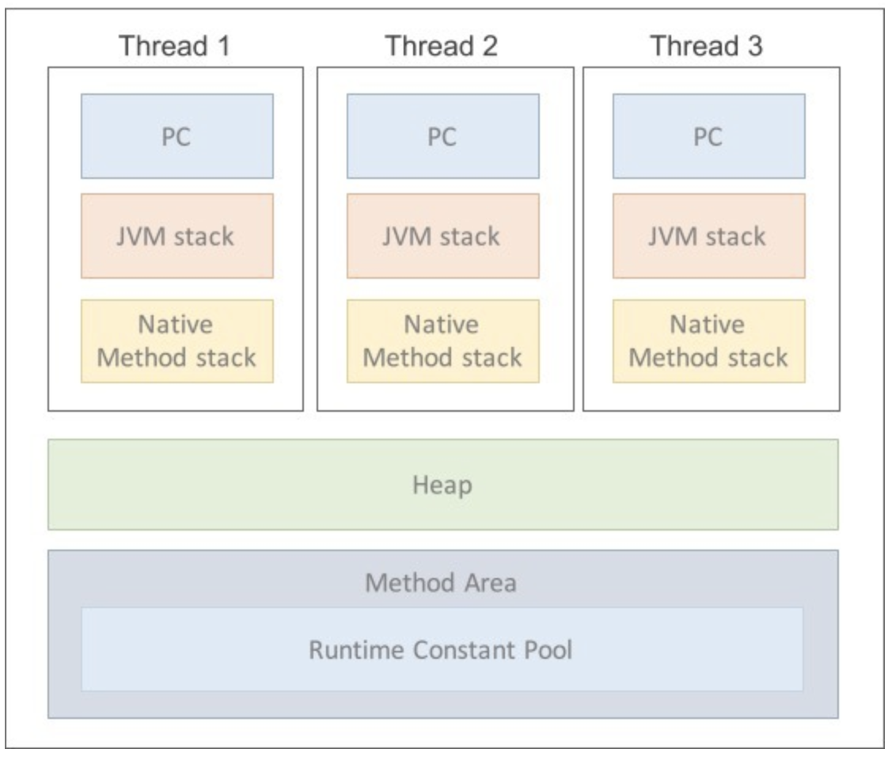
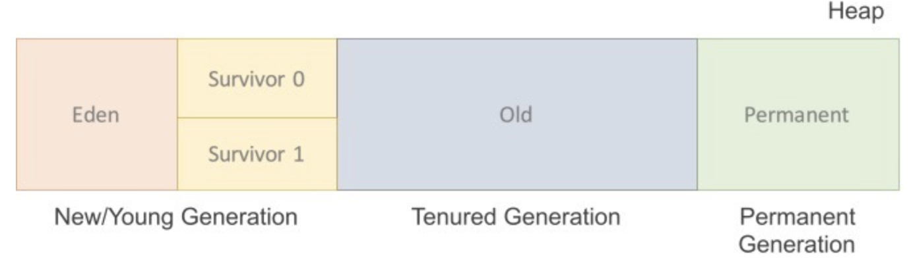
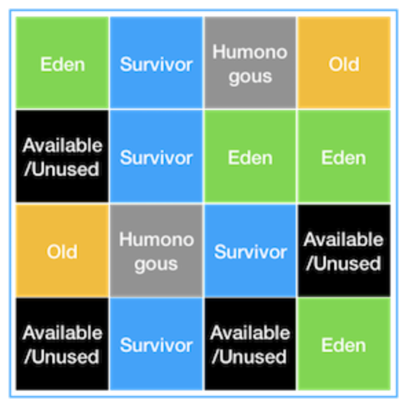

# Second Week

### JVM

> Java Virtual Machine.
>
> Stack 기반의 Java 가상 머신
>
> (가상 머신이란, 프로그램을 실행하기 위한 물리적 머신과 유사한 머신을 소프트웨어로 구현한 것.)

#### Java Application 실행 과정

1. Application이 실행되면 JVM은 OS로부터 이 프로그램이 필요로 하는 메모리를 할당 받음.

   JVM은 이 메모리를 용도에 따라 여러 영역으로 나누어 관리.

2. Java Compiler(javac)가 java source code(.java)를 읽어 들여 java byte code로 변환(.class)

3. Class Loader를 통해 class 파일들을 JVM으로 로딩.

4. 로딩된 class 파일들은 Execution Engine을 통해 해석 됨.

5. 해석된 byte code는 Runtime Data Areas에 배치되어 실질적인 수행이 이뤄지게 됨.

   이러한 실행과정 속에서 JVM은 필요에 따라 Thread Synchronization과 GC같은 관리 작업을 수행.

#### 역할

* Java Application을 Class Loader를 통해 읽어 들여 Java API와 함께 실행.
* JAVA와 OS 사이에서 중개자 역할을 수행.
  * Java Byte Code를 OS에 맞게 해석. 
  * Java가 OS에 구애 받지 않고 재사용(WORA; Write Once Run Anywhere)이 가능한 이유.
* 메모리 관리, Garbage Collection을 수행.

#### 구성

* ##### Class Loader

  * **JVM이 운영체제로부터 할당받은 메모리영역(Runtime Data Area)에 컴파일 된 class 파일(.class)들을 엮어서 적재**

    * JVM내로 class 파일(.class)을 로드하고, 링크를 통해 배치하는 작업을 수행하는 모듈.

      > **Loading**
      >
      > * 클래스 파일에서 클래스 이름, 상속관계, 클래스의 타입(class, interface, enum) 정보, 메소드 & 생성자 & 멤버변수 정보, 상수 등에 대한 정보를 로딩해서 Binary 데이터로 변경.
      >
      > **Linking** 
      >
      > * Verification 과 Preparation, Resolution 단계를 거치면서 바이트코드를 검증하고 필요한 만큼의 메모리를 할당한다. Resolution 과정에서는 Symbolic Reference 를 Direct Reference 등으로 변경.
      >
      >  **Initialization**
      >
      > * static block 의 초기화 및 static 데이터들을 할당. Top->Bottom 방식으로 클래스들을 해석.

  * Runtime 시에 동적으로 class 파일을 로드.

  * jar 파일 내 저장된 class 파일들을 JVM 위에 탑재하고, 사용하지 않는 class 파일들은 메모리에서 삭제.

  * 클래스를 처음으로 참조할 때, 해당 클래스를 로드하고 링크함.

  * 구성

    * Bootstrap Class Loader
      * 부트스트랩 경로에서 클래스를 로드하는 역할
      * JVM이 실행될 때 같이 메모리에 올라감
      * 유일하게 JAVA가 아니라 네이티브 코드로 구현되어 있음
      * 우선 순위가 가장 높은 로더
    * Extension Class Loader
      * ext 폴더(jre / lib)에 있는 클래스를 로드하는 작업을 담당
    * Application(=System) Class Loader
      * 응용 프로그램 수준 클래스 경로, 환경 변수 등을 로드하는 데 사용.
      * 부트스트과 익스텐션 클래스 로더가 JVM 자체의 구성요소들을 로드한다면,
      * 시스템 클래스 로더는 어플리케이션의 클래스들을 로드함.
      * 가장 후 순위

  * 실행 과정

    

    * Class Loader가 class파일(.class)의 위치를 찾아 JVM 위에 올려놓는 과정

      > System loader => (위임) Extension Class Loader => (위임) Bootstrap Loader 
      >
      > Bootstrap Loader에서 클래스를 못 찾았을 시 => Extension Class Loader 
      >
      > Extension Class Loader에서 클래스를 못 찾았을 시 => System Loader
      >
      > System Loader에서 클래스를 못 찾았을 시 => throw ClassNotFoundException

* ##### Execution Engine

  * **Class Loader에 의해 메모리에 적재된 클래스(Byte code)들을 기계어로 변경해 명령어 단위로 실행**
  * 구성
    * **Interpreter**
      * **Byte code를 명령어 단위로 읽어서 실행.**
      * 바이트 코드를 더 빠르게 해석하지만, **한 줄 씩 실행하기 때문에 느리다는 단점이 있음.**
      * 하나의 메소드가 여러 번 호출될 때마다 **매번 새로운 해석**이 요구됨
    * **JIT(Just-In-Time) Compiler**
      * Interpreter 방식의 단점을 보완하기 위해 도입된 Compiler
      * **Interpreter 방식으로 실행하다가 적절한 시점에 byte code 전체를 compile** 
        **-> native code로 변경, 이후에 해당 코드를 더 이상 intepreting 하지 않고 native code로 직접 실행하는 것으로 성능을 높이는 방식.**
      * **native code는 cache에 보관하기 때문에 한 번 컴파일된 코드는 빠르게 수행하게 됨.**
      * 하지만, JIT compiler가 compile 하는 과정은 byte code를 interpreting 하는 것보다 훨씬 오래 걸림
        * 따라서, 한 번만 실행되는 코드라면 compile 하지 않고 interpreting 하는 것이 유리.
      * JIT를 사용하는 JVM들은 내부적으로 해당 method가 얼마나 자주 수행되는지 체크, 일정 정도를 넘을 때에만 complie을 수행.
    * **Garbage collector**
      * **Heap 메모리 영역에 생성(적재)된 객체들 중에서 참조되지 않는 객체들을 탐색 후 제거하는 역할**
      * GC가 수행되는 동안 STW가 발생함.

* ##### Runtime Data Area

  

  * **JVM의 메모리 영역**으로 Java Application을 실행할 때 **사용되는 데이터들을 적재하는 영역**

  * 이 영역은 크게 5개로 구분.

    * **Method Area(=Class Area, Static Area)**

      * Class 정보를 처음 메모리 공간에 올릴 때 초기화되는 대상을 저장하기 위한 메모리 공간.

      * 모든 쓰레드가 공유

      * **클래스의 모든 정보**

        > **Field Information**
        >
        > * 멤버변수의 이름, 데이터 타입, 접근 제어자에 대한 정보
        >
        > **Method Information**
        >
        > * 메서드의 이름, 리턴 타입, 매개변수, 접근제어자에 대한 정보
        >
        > **Type Information**
        >
        > * Class인지 Interface인지의 여부
        > * Type 속성, 전체 이름, super class의 전체 이름
        >   (interface, Object인 경우 제외)
        >
        > **Constant Pool(상수 풀: 문자 상수, 타입, 필드, 객체 참조가 저장)**
        >
        > **static 변수, final class 변수 등**이 생성되는 영역

    * **Heap**

      * 객체를 저장하는 가상 메모리 공간
      * **new 연산자로 생성된 객체와 배열을 저장**
      * Method Area에 로드된 클래스만 생성이 가능
      * **Garbage Collector가 참조되지 않은 객체를 확인하고 제거하는 영역**
      * 모든 쓰레드가 공유

    * **PC Register**

      * Thread가 시작될 때 생성, Thread마다 하나씩 존재(공유 X)
      * **Program Counter 즉, 현재 Thread가 어떤 부분을 어떤 명령으로 실행해야할 지에 대한 기록을 하는 부분.**
      * 현재 수행 중인 JVM 명령의 주소를 가짐.

    * **(JVM)Stack Area**

      * **local variable, parameter, return value, 연산에 사용되는 임시 값 등이 생성되는 영역**
      * 메서드를 호출할 때마다 개별적으로 stack이 생성됨.
      * 각각의 Thread마다 생성, 공유되지 않음

    * **Native Method Stack**

      * 자바 프로그램이 컴파일되어 생성되는 byte code가 아닌, 실제 실행할 수 있는 **기계어로 작성된 프로그램을 실행시키는 영역**.

      * Native Interface를 통해 byte code로 전환, 저장.

      * 각각의 Thread마다 생성, 공유되지 않음

        

-----

### GC

> Garbage Collection
>
> **Heap 메모리 영역에 생성(적재)된 객체들 중에서 참조되지 않는 객체들을 탐색 후 제거**하는 것을 말함
>
> * Heap을 재활용하기 위해 root set에서 참조되지 않은 instance를 없애 **가용한 공간을 만듦**.
>
>   > **참조 여부를 객체마다 확인** 하고 **아무것도 가리키지 않는 객체를 찾아내어**(mark algorithm)
>   >
>   > **메모리에서 제거**하고, **참조되는 것만 남김**.
>   >
>   > 한 곳에 모으기까지가 일반적인 garbage collection.
>
> * 전제 조건
>
>   * 대부분의 객체는 금방 접근 불가능한 상태가 된다.
>   * Old instance 에서 Young instance로의 참조는 아주 적게 존재한다.

#### Minor GC Algorithm

> New/Young Generation에서 일어나는 GC
>
> > Eden : 객체들이 최초로 생성되는 공간
> >
> > Survivor 0/1 : Eden에서 참조되는 객체들이 저장되는 공간

* **과정**

  1. 객체가 Eden 영역에 생성.

  2. 객체가 계속 생성되어 Eden 영역이 가득 차게 되면,

  3. GC가 발생하여 살아남은 객체들은 Survivor0의 영역으로 이동.

     (이후에 Eden 영역에서 GC가 발생하면 이미 살아남은 객체가 존재하는 Survivor 영역으로 객체가 계속 쌓인다.)

  4. 이러한 과정을 반복해서 거치다가 Survivor0의 영역이 가득 차게 되면 GC가 발생
     -> Survivor1로 이동.(가득 찬 Survivor 영역은 아무 데이터도 없는 상태가 된다.)

  5. 이런 과정을 반복하다 어느 일정 횟수(Default : 31) 이상 살아남은 객체들은 Old Generation으로 넘어감.

#### Major GC(=Full GC) Alogorithm

> Old Generation에 있는 모든 객체들을 검사하여 참조되지 않은 객체들을 한꺼번에 삭제.
>
> 시간이 오래 걸리며, STW(Stop-The-World, GC를 실행하기 위해 JVM이 application 실행을 멈추는 것) 발생.

* 방식

  * Serial GC

    * Used Algorithm : Mark-Sweep-Compact

      * 기본적인 Algorithm

        > * 사용되지 않는 객체를 식별하는 작업 (**Mark**)
        > * 사용되지 않는 객체를 제거하는 작업 (**Sweep**)
        > * 파편화된 메모리 영역을 앞에서부터 채워나가는 작업 (**Compaction**)

  * Parallel GC

    * Used Algorithm : Mark-Sweep-Compact
    * Serial GC의 Multi-thread version

  * Parallel Old GC

    * Used Algorithm : Mark-Summary-Compaction
    * Java 7, 8의 Default GC

  * Concurrent-Mark Sweep GC(CMS)

    * Used Algorithm : Concurrent-Mark-Sweep
    * STW(Stop-The-World) 시간을 최소화 하는데 초점을 맞춘 GC 방식
      * "GC 대상을 최대한 자세히 파악한 후, 정리하는 시간(STW가 발생하는 시간)을 짧게 가지겠다"
      * GC 대상을 파악하는 과정이 복잡하한 여러단계로 수행되기 때문에 다른 GC 대비 CPU 사용량이 높다.

  * G1 GC

    * Java 9, 10의 Default GC

  * Z GC

#### G1 GC

> Garbage First GC

* **목적**

  * 큰 Heap Memory에서 **짧은 GC 시간을 보장**하는 것

  * G1 GC가 적용된 JVM Heap 구조

    

  * 다른 GC와는 다른 방식으로 heap을 관리.

    * Eden, Survivor, Old 영역이 존재

      * 고정된 크기로 고정된 위치에 존재하는 것이 아니라는 것이 차이점.
      * 전체 heap memory 영역을 Region 이라는 특정한 크기로 나눠서
        각 Region의 상태에 따라 그 Region에 역할(Eden, Survivor, Old)이 동적으로 부여됨.
      * JVM heap은 2048개의 Region 으로 나뉠 수 있으며, 각 Region의 크기는 1MB ~ 32MB 사이로 지정될 수 있다

    * Humongous, Available/Unused 이 존재

      > - **Humongous** : Region 크기의 50%를 초과하는 **큰 객체를 저장하기 위한 공간**이며, 이 Region 에서는 GC 동작이 최적으로 동작하지 않음.
      > - **Available/Unused** : 아직 사용되지 않은 Region을 의미.

  * G1 GC에서의 Young GC

    * STW 발생
    * 각 Region 중 GC대상 객체가 가장 많은 Region(Eden 또는 Survivor 역할) 에서 수행
    * 이 Region 에서 **살아남은 객체를 다른 Region(Survivor 역할) 으로 옮긴 후, 비워진 Region을 사용가능한 Region으로 돌리는 형태** 로 동작

  * G1 GC에서의 Full GC

    * **Initial Mark -> Root Region Scan -> Concurrent Mark -> Remark -> Cleanup -> Copy**

      >**Initial Mark**
      >
      >- Old Region 에 존재하는 객체들이 참조하는 Survivor Region 을 탐색. 
      >- STW 현상 발생.
      >
      >**Root Region Scan**
      >
      >- Initial Mark 에서 찾은 Survivor Region에 대한 GC 대상 객체 스캔 작업을 진행.
      >
      >**Concurrent Mark**
      >
      >- 전체 힙의 Region에 대해 스캔 작업을 진행.
      >- GC 대상 객체가 발견되지 않은 Region 은 이후 단계를 처리하는데 제외함.
      >
      >**Remark**
      >
      >* 최종적으로 GC 대상에서 제외될 객체(살아남을 객체)를 식별.
      >* STW 발생.
      >
      >**Cleanup**
      >
      >- 살아있는 객체가 가장 적은 Region 에 대한 미사용 객체 제거 수행.
      >  - STW 발생.
      >- 이후 STW를 끝내고, 앞선 GC 과정에서 완전히 비워진 Region 을 Freelist에 추가하여 재사용될 수 있게 함.
      >
      >**Copy**
      >
      >- GC 대상 Region 이었지만, Cleanup 과정에서 완전히 비워지지 않은 Region의 살아남은 객체들을 새로운(Available/Unused) Region 에 복사, Compaction 작업을 수행.

